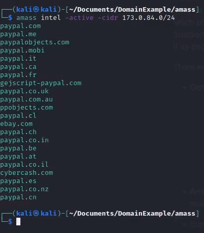

# 🛡️ Introducción a AMASS

**AMASS** (Asset Mapping and Scanning System) es una herramienta de código abierto desarrollada por OWASP para la identificación, mapeo y análisis de activos digitales. Es ampliamente utilizada en ciberseguridad ofensiva y defensiva, ya que permite descubrir dominios, subdominios, direcciones IP y otras superficies de ataque expuestas.

## 🚀 Funcionalidades principales

- Reconocimiento pasivo y activo de dominios
- Enumeración de redes mediante OSINT
- Visualización de relaciones entre activos
- Integración con fuentes como Shodan, VirusTotal, Censys
- Automatización de auditorías de seguridad

## 🔧 Casos de uso

- Evaluación de exposición digital
- Pentesting y simulaciones de ataque
- Monitoreo de infraestructura pública
- Investigación de amenazas

## 📦 Ventajas

- Flexibilidad para distintos entornos
- Comunidad activa
- Integración en flujos de trabajo complejos

---

💡 *AMASS es mantenida por OWASP (Open Worldwide Application Security Project), lo que garantiza su calidad y enfoque en la seguridad.*


## Instalación y configuración:

Para empezar, tendremos que bajarnos el repositorio de amass en github, cuya dirección es [esta](https://github.com/owasp-amass/amass).

En una máquina virtual, preferiblemente kali linux, tendremos que clonar el repositorio en local, con el siguiente comando:


## 📦 Comando para clonar

```bash
git clone https://github.com/owasp-amass/amass.git

```

Una vez instalado, veremos que contiene la carpeta /amass donde dentro incluye:


Para ver la ayuda de la herramienta, tendremos que usar el comando:

```bash
amass -h

```

Donde veremos que incluye toda la información relacionada con la herramienta:


El siguiente comando muestra la ayuda del subcomando enum, que se usa para enumerar subdominios de un dominio objetivo:

```bash
amass enum -h

```

Cuyo resultado es este:


## 🔍 Enumeración de subdominios con Amass

El siguiente comando utiliza OWASP Amass para buscar subdominios del dominio `google.com` con salida detallada:

```bash
amass enum -v -d google.com

```


# 🛡️ Guía avanzada de comandos OWASP Amass

Esta guía documenta comandos avanzados de OWASP Amass, explicando su uso y propósito en tareas de reconocimiento, inteligencia de red, enumeración de subdominios y seguimiento de activos.

---

## 🔍 1. Recopilación de inteligencia

```bash
amass intel -d owasp.org -whois

```

- **Descripción**: Busca dominios relacionados con `owasp.org` usando fuentes pasivas y registros WHOIS.
- **Uso**: Útil para descubrir dominios adicionales que podrían estar bajo el mismo control administrativo.


---

```bash
amass intel -active -cidr 173.0.84.0/24

```

- **Descripción**: Realiza consultas activas sobre el rango de IPs `173.0.84.0/24`.
- **Uso**: Permite identificar dominios o subdominios alojados en ese rango IP.



---

```bash
amass intel -org "Tesla"

```

- **Descripción**: Busca dominios relacionados con la organización registrada como "Tesla".
- **Uso**: Ideal para mapear la superficie de exposición de una empresa específica.

---

```bash
amass intel -active -asn 394161

```

- **Descripción**: Realiza consultas activas sobre el ASN (Autonomous System Number) `394161`.
- **Uso**: Identifica dominios e IPs asociados a ese sistema autónomo, útil para rastrear infraestructura de red.

---

```bash
amass intel -asn 394161 -whois -d tesla.com

```

- **Descripción**: Combina búsqueda por ASN, registros WHOIS y dominio específico (`tesla.com`).
- **Uso**: Proporciona una vista más completa de los activos relacionados con Tesla.

---

## 🌐 2. Enumeración de subdominios

```bash
amass enum -d example.com

```

- **Descripción**: Realiza una enumeración pasiva de subdominios del dominio `example.com`.
- **Uso**: Útil para obtener una lista básica de subdominios sin realizar verificaciones activas.

---

```bash
amass enum -d tesla.com -active -cidr 8.21.14.0/24 -asn 394161

```

- **Descripción**: Enumeración activa de subdominios de `tesla.com`, incluyendo verificación en el rango IP y ASN especificados.
- **Uso**: Ideal para ampliar el alcance de descubrimiento y verificar subdominios en tiempo real.

---

## 🔄 3. Seguimiento de cambios

```bash
amass track -help

```

- **Descripción**: Muestra la ayuda del subcomando `track`, incluyendo todas sus opciones disponibles.
- **Uso**: Útil para entender cómo configurar el seguimiento de activos.

---

```bash
amass track -d tesla.com

```

- **Descripción**: Compara resultados actuales con anteriores para el dominio `tesla.com`.
- **Uso**: Detecta nuevos subdominios o cambios en la infraestructura.

---

## 🧬 4. Consulta de base de datos

```bash
amass db -show -d tesla.com

```

- **Descripción**: Muestra los datos almacenados en la base de datos interna de Amass para `tesla.com`.
- **Uso**: Permite revisar hallazgos históricos y realizar auditorías.

---

## 📡 5. Resolución DNS directa

```bash
amass dns -d tesla.com

```

- **Descripción**: Realiza resolución DNS sobre el dominio `tesla.com`.
- **Uso**: Verifica subdominios y registros DNS directamente, sin realizar enumeración completa.

---

## 📌 Recomendaciones generales

- Usa `-active` para obtener resultados más precisos y actualizados.
- Combina `intel`, `enum`, y `track` para un ciclo completo de reconocimiento.
- Exporta resultados con `-o archivo.txt` para integrarlos en escáneres como Nmap o Nikto.


