# 🛡️ Introducción a AMASS

**AMASS** (Asset Mapping and Scanning System) es una herramienta de código abierto desarrollada por OWASP para la identificación, mapeo y análisis de activos digitales. Es ampliamente utilizada en ciberseguridad ofensiva y defensiva, ya que permite descubrir dominios, subdominios, direcciones IP y otras superficies de ataque expuestas.

## 🚀 Funcionalidades principales

- Reconocimiento pasivo y activo de dominios
- Enumeración de redes mediante OSINT
- Visualización de relaciones entre activos
- Integración con fuentes como Shodan, VirusTotal, Censys
- Automatización de auditorías de seguridad

## 🔧 Casos de uso

- Evaluación de exposición digital
- Pentesting y simulaciones de ataque
- Monitoreo de infraestructura pública
- Investigación de amenazas

## 📦 Ventajas

- Flexibilidad para distintos entornos
- Comunidad activa
- Integración en flujos de trabajo complejos

---

💡 *AMASS es mantenida por OWASP (Open Worldwide Application Security Project), lo que garantiza su calidad y enfoque en la seguridad.*


## Instalación y configuración:

Para empezar, tendremos que bajarnos el repositorio de amass en github, cuya dirección es [esta](https://github.com/owasp-amass/amass).

En una máquina virtual, preferiblemente kali linux, tendremos que clonar el repositorio en local, con el siguiente comando:


## 📦 Comando para clonar

```bash
git clone https://github.com/owasp-amass/amass.git

```

Una vez instalado, veremos que contiene la carpeta /amass donde dentro incluye:

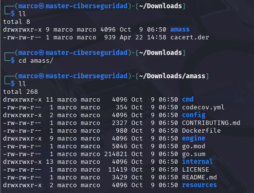

Para ver la ayuda de la herramienta, tendremos que usar el comando:

```bash
amass -h

```

Donde veremos que incluye toda la información relacionada con la herramienta:

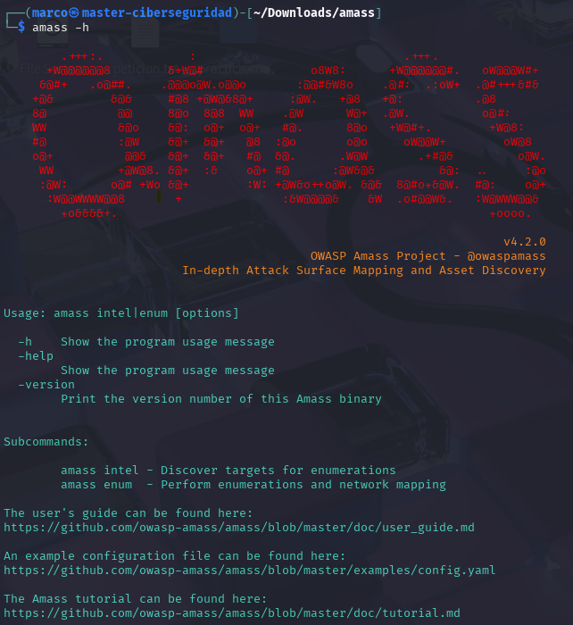

El siguiente comando muestra la ayuda del subcomando enum, que se usa para enumerar subdominios de un dominio objetivo:

```bash
amass enum -h

```

Cuyo resultado es este:

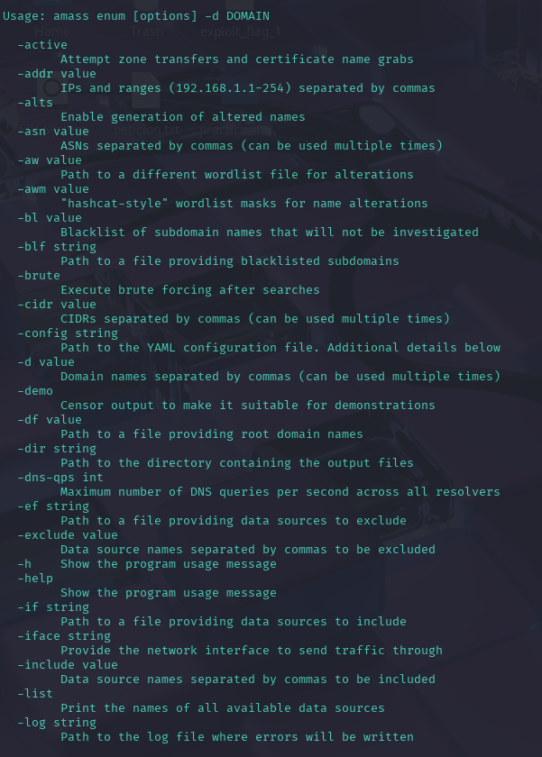

---

El siguiente comando muestra la ayuda del subcomando intel, que se utiliza para recolectar información previa sobre dominios relacionados con un objetivo, como parte del proceso de enumeración de subdominios.

```bash
amass intel -h

```

Cuyo resultado es este:

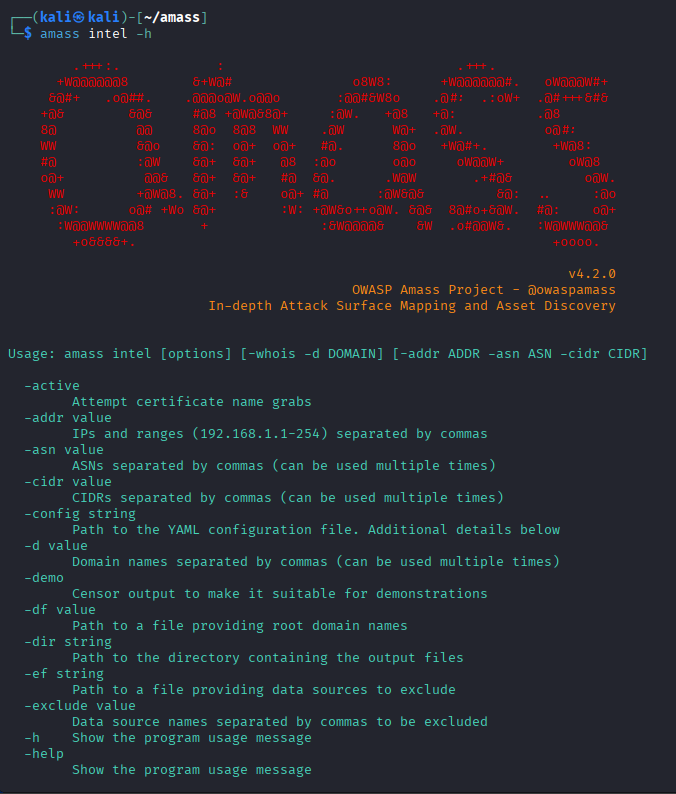

## 🔍 Enumeración de subdominios con Amass

El siguiente comando utiliza OWASP Amass para buscar subdominios del dominio `google.com` con salida detallada:

```bash
amass enum -v -d google.com

```

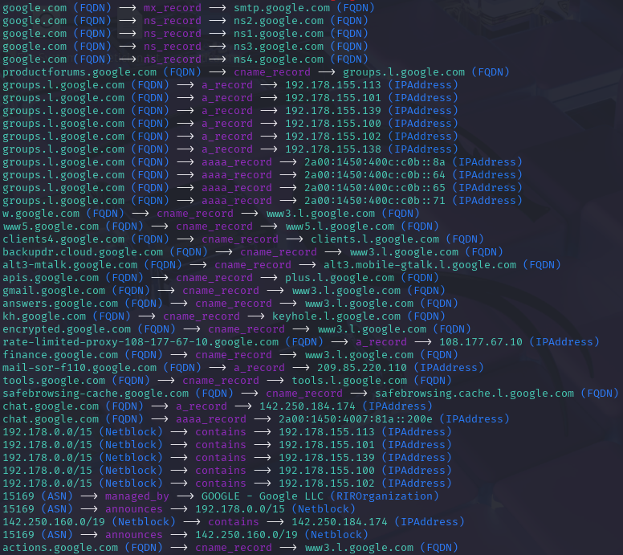

# 🛡️ Guía avanzada de comandos OWASP Amass

Esta guía documenta comandos avanzados de OWASP Amass, explicando su uso y propósito en tareas de reconocimiento, inteligencia de red, enumeración de subdominios y seguimiento de activos.

---

## 🔍 1. Recopilación de inteligencia

```bash
amass intel -d owasp.org -whois

```

- **Descripción**: Busca dominios relacionados con `owasp.org` usando fuentes pasivas y registros WHOIS.
- **Uso**: Útil para descubrir dominios adicionales que podrían estar bajo el mismo control administrativo.

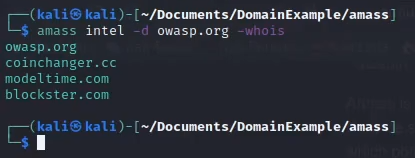

---

```bash
amass intel -active -cidr 173.0.84.0/24

```

- **Descripción**: Realiza consultas activas sobre el rango de IPs `173.0.84.0/24`.
- **Uso**: Permite identificar dominios o subdominios alojados en ese rango IP.

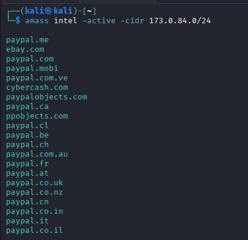

---

```bash
amass intel -org "Tesla"

```

- **Descripción**: Busca dominios relacionados con la organización registrada como "Tesla".
- **Uso**: Ideal para mapear la superficie de exposición de una empresa específica.

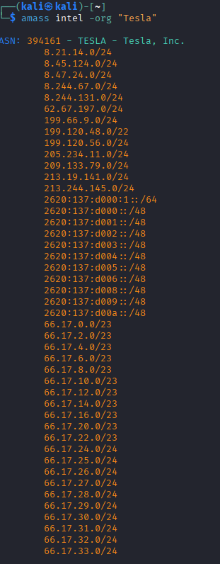

---

```bash
amass intel -active -asn 394161

```

- **Descripción**: Realiza consultas activas sobre el ASN (Autonomous System Number) `394161`.
- **Uso**: Identifica dominios e IPs asociados a ese sistema autónomo, útil para rastrear infraestructura de red.

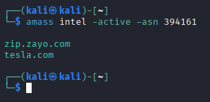


---

```bash
amass intel -d example.com -asn 13335

```

- **Descripción**:Busca dominios relacionados con example.com y el ASN 13335 (Cloudflare).
- **Uso**: Útil para identificar activos vinculados a la infraestructura de red de Cloudflare que podrían estar relacionados con el dominio objetivo.

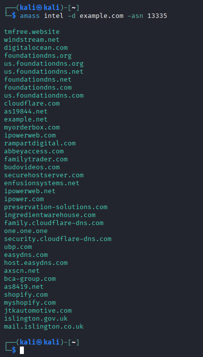

---

```bash
amass intel -org "Apple Inc." -whois -o apple_intel.txt
amass intel -org "Apple Inc." -whois > apple_intel.txt

```

- **Descripción**: Este comando utiliza el subcomando intel de Amass para realizar una búsqueda de inteligencia previa enfocada en la organización Apple Inc.. Específicamente, emplea consultas WHOIS para identificar dominios registrados que estén relacionados con esa entidad.
- **Uso**: Reconocimiento previo a la enumeración: Ideal para ampliar el alcance de dominios antes de ejecutar amass enum. Investigación corporativa: Útil para mapear el ecosistema digital de una empresa.
Automatización: El archivo de salida puede integrarse en pipelines, herramientas como Faraday, o scripts personalizados.

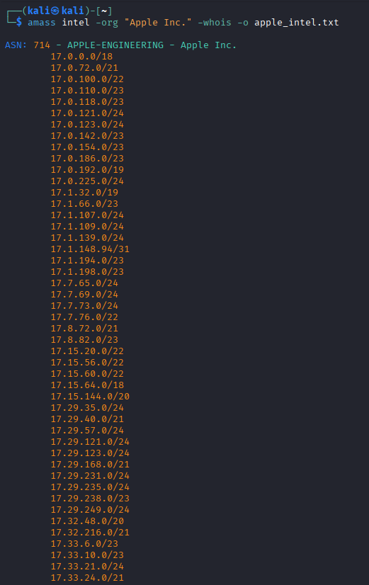

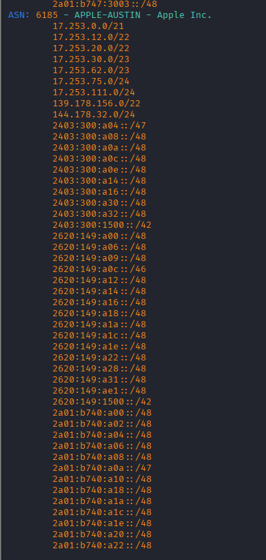


-Si hacemos un:

```bash
cat apple_intel.txt

```

Veremos que se nos ha generado el archivo:

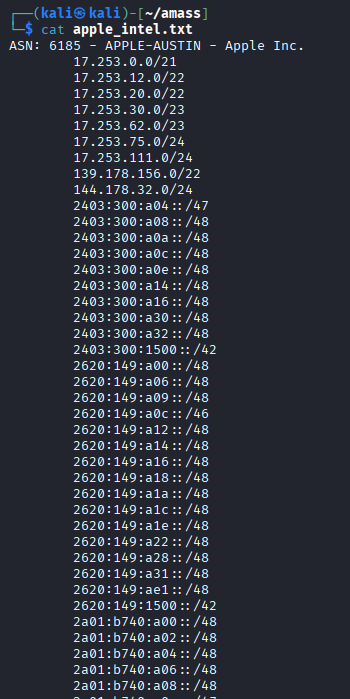

---

## 🌐 2. Enumeración de subdominios

```bash
amass enum -d example.com

```

- **Descripción**: Realiza una enumeración pasiva de subdominios del dominio `example.com`.
- **Uso**: Útil para obtener una lista básica de subdominios sin realizar verificaciones activas.

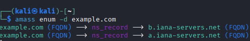

---

```bash
amass enum -d tesla.com -active -cidr 8.21.14.0/24 -asn 394161

```

- **Descripción**: Enumeración activa de subdominios de `tesla.com`, incluyendo verificación en el rango IP y ASN especificados.
- **Uso**: Ideal para ampliar el alcance de descubrimiento y verificar subdominios en tiempo real.

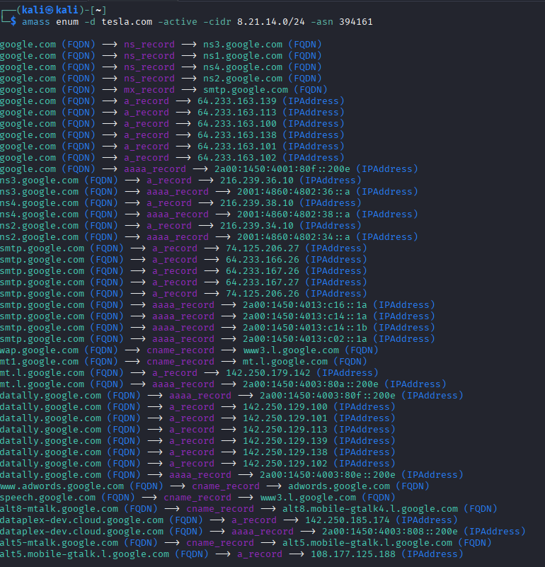

---

```bash
amass enum -d example.com -r 8.8.8.8 -tr 1.1.1.1

```

- **Descripción**: Realiza enumeración de subdominios de example.com utilizando resolvers DNS personalizados (Google y Cloudflare).
- **Uso**: Mejora la resolución DNS y evita bloqueos por parte de resolvers predeterminados.

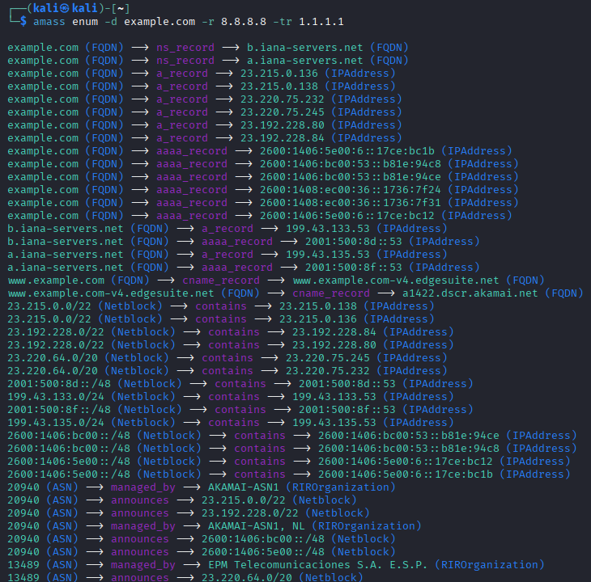

---

```bash
amass enum -d example.com -brute -norecursive

```

- **Descripción**: Fuerza bruta de subdominios sin recursividad, útil para obtener nombres directos sin expandir jerarquías.
- **Uso**: Ideal para entornos donde se desea limitar la profundidad de descubrimiento o acelerar el proceso.

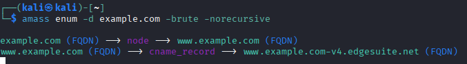

---

## 📌 Recomendaciones generales

- Usa `-active` para obtener resultados más precisos y actualizados.
- Combina `intel` y `enum` para un ciclo completo de reconocimiento.
- Exporta resultados con `> archivo.txt` para integrarlos en escáneres como Nmap o Nikto.


