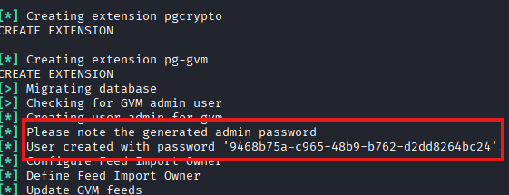
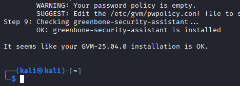
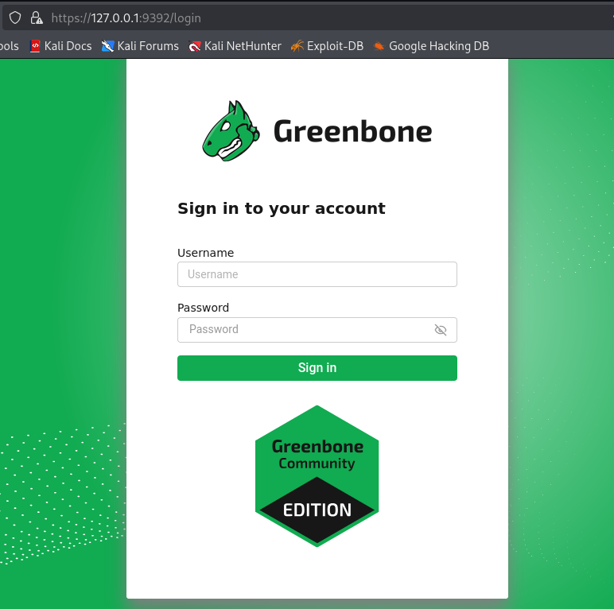
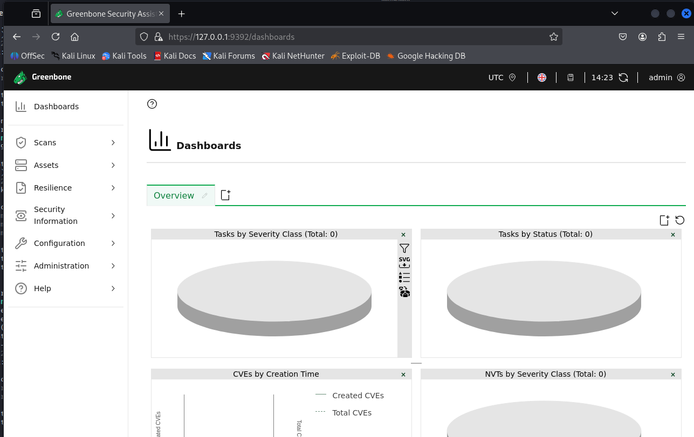
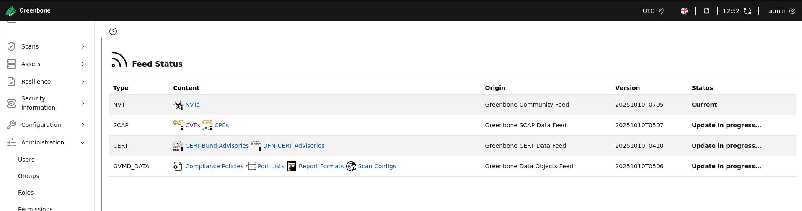
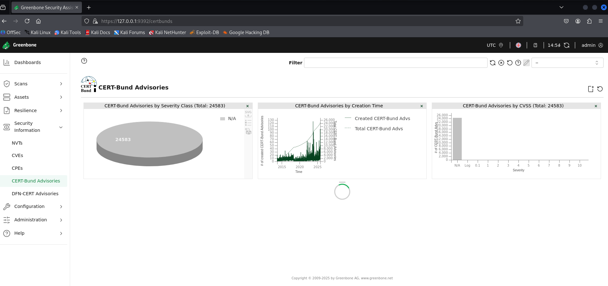
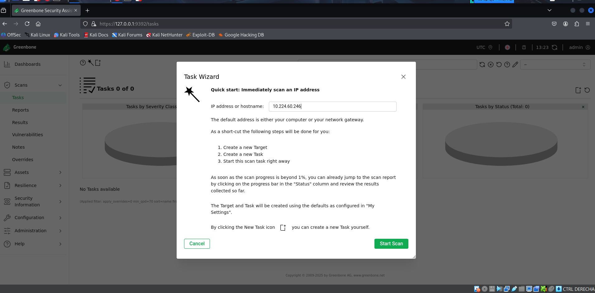

# 🔍 Introducción a OpenVAS: Sistema de Evaluación de Vulnerabilidades

**OpenVAS** (Open Vulnerability Assessment System) es una plataforma de código abierto especializada en la **detección y gestión de vulnerabilidades** en sistemas informáticos. Forma parte del proyecto **Greenbone Vulnerability Management (GVM)** y es ampliamente utilizada en auditorías de seguridad, análisis de riesgos y cumplimiento normativo.

## ⚙️ ¿Qué ofrece OpenVAS?

- Escaneo profundo de redes, servidores y dispositivos
- Base de datos actualizada con miles de vulnerabilidades (NVTs)
- Generación de informes detallados y exportables
- Integración con herramientas como SIEM, firewalls y gestores de tickets
- Gestión de credenciales para escaneos autenticados

## 🧪 Casos de uso comunes

- Evaluación de seguridad en infraestructuras corporativas
- Pruebas de cumplimiento con normativas como ISO 27001, PCI-DSS o RGPD
- Identificación de configuraciones inseguras o software obsoleto
- Soporte en procesos de remediación y mejora continua

## 🛠️ Ventajas de usar OpenVAS

- **Código abierto y gratuito**
- **Actualizaciones frecuentes** de vulnerabilidades
- **Interfaz web intuitiva** mediante Greenbone Security Assistant (GSA)
- **Escalabilidad** para entornos pequeños y grandes

---

> 💡 *OpenVAS es mantenido por Greenbone y se integra dentro del ecosistema GVM, lo que garantiza su enfoque profesional y su alineación con estándares internacionales de seguridad.*


## Instalación y configuración

Para empezar tenemos que actualizar los paquetes con:

```bash
sudo apt update && sudo apt upgrade

```

Una vez instalado, debemos montar el setup del programa para que nos genere el servicio con:

```bash
sudo gvm-setup

```

Una vez haya termindado, debemos copiar el usuario y contraseña generadas,ya que lo vamos a necesitar durante el proyecto, vieéndose algo así:



Posteriormente, ponemos el siguiente comando que sirve como verificador de estado para la instalación y configuración de Greenbone Vulnerability Management (GVM):

```bash
sudo gvm-check-setup

```

Si todo ha ido bien: veremos que nos muestra el mensaje de verificación:




Para iniciar o parar el servicio, son esos los siguientes comandos:

```bash
sudo gvm-start
sudo gmv-stop

```

Una vez ha arrancado el servidor, nos abrirá un entorno web sobre el puerto 9392, donde nos pedirá el usuario y contraseña que previamente nos ha dado en la instación y configuración:



Si el acceso ha sido exitoso, tendremos que ver lo siguiente:



---

# Uso práctico

En el panel, si nos dirigimos hacia la dirección Administration/Feed Status, podemos ver que el estado actual del servicio está activo y el resto está en acutalización (Toma su tiempo):



## 🧠 Sección: CERT-Bund Advisories

Los datos visualizados provienen de los **CERT-Bund Advisories**, emitidos por el BSI (Oficina Federal de Seguridad Informática de Alemania).

### 1. CERT-Bund Advisories por Severidad

- **Total de avisos:** 24,803
- **Clasificación:** Todos los avisos están marcados como `N/A` (No disponible).
- **Interpretación:** La severidad no ha sido asignada o no está categorizada en el feed actual.

### 2. CERT-Bund Advisories por Fecha de Creación

- **Visualización:** Gráfico de barras por año.
- **Tendencia:** Aumento significativo en el número de avisos en los últimos años.
- **Utilidad:** Permite identificar picos de actividad y evolución de amenazas.

### 3. CERT-Bund Advisories por CVSS

- **Total de avisos:** 24,803
- **Distribución:** La mayoría tienen un CVSS de `0`.
- **Interpretación:** Muchos avisos carecen de puntuación de riesgo asignada.

## 🧭 Navegación del Dashboard

- **Panel lateral:** Acceso a secciones como `Dashboard`, `Scans`, `Assets`, `Resilience`, `Info`, y `CVEs`.
- **Barra superior:** Filtros de búsqueda, opciones de usuario y estado de carga.

## 🛠️ Aplicación práctica

Este panel es útil para:
- Analizar tendencias de vulnerabilidades.
- Detectar gaps en la clasificación de riesgos.
- Priorizar escaneos según contexto y severidad.
- Integrar datos con plataformas como Faraday para gestión centralizada.



---

## 🎯 Objetivo del asistente

Para ello, tenemos que ir al directorio Scans/Tasks, donde le damos a Task Wizard y ponemos una dirección a escanear.



Permite realizar un escaneo rápido sobre una IP o hostname específico, sin necesidad de configurar manualmente todos los parámetros.

### 🧩 Elementos clave del asistente

- **Campo de entrada:**  
  `IP address or hostname` → En el ejemplo se usa `10.224.60.246`.

- **Instrucciones del flujo de escaneo:**
  1. Crear un nuevo **Target** (objetivo).
  2. Crear una nueva **Task** (tarea) usando ese Target.
  3. Iniciar la Task.

- **Información adicional:**
  - Se puede escanear rangos de IP.
  - Se utilizan configuraciones por defecto si no se personaliza.

- **Opciones disponibles:**
  - ✅ Checkbox para crear la tarea manualmente si se desea más control.
  - 🔘 Botones: `Cancel` y `Start Scan`.

## 🛠️ Aplicación práctica

Este asistente es útil para:
- Ejecutar escaneos rápidos en entornos de laboratorio o producción.
- Validar dispositivos recién conectados a la red.
- Automatizar tareas básicas sin configurar manualmente cada parámetro.

## 📌 Recomendaciones

- Para escaneos más avanzados, usa el panel completo de `Tasks` y configura:
  - Escaneo intensivo (`Full and fast`)
  - Credenciales
  - Políticas personalizadas
- Integra los resultados con Faraday para gestión centralizada.

---

# 🛡️ Funcionalidades de Greenbone OpenVAS (GVM)

Greenbone Vulnerability Management (GVM), también conocido como OpenVAS, es una plataforma completa para la gestión de vulnerabilidades. A continuación se resumen sus principales módulos y opciones disponibles en la interfaz de Greenbone Security Assistant (GSA).

---

## 📊 Dashboard

- Vista general del estado del sistema.
- Estadísticas de escaneos, vulnerabilidades, CVEs y severidad.
- Gráficos por tiempo, CVSS, y clasificaciones CERT-Bund.

---

## 🎯 Targets

- Definición de objetivos de escaneo (IP, rangos, hostnames).
- Configuración de credenciales (SSH, SMB, SNMP).
- Personalización de puertos y protocolos.

---

## 📋 Tasks

- Creación de tareas de escaneo.
- Selección de políticas (`Full and fast`, `Host Discovery`, etc.).
- Programación de escaneos recurrentes.
- Asociación con Targets y Escaners.

---

## 🔍 Results

- Visualización de resultados por tarea.
- Detalles de vulnerabilidades detectadas.
- Filtros por severidad, CVSS, estado y fecha.
- Exportación en formatos como PDF, XML, HTML.

---

## 🧩 CVEs

- Navegación por vulnerabilidades conocidas.
- Búsqueda por ID, producto, severidad o fecha.
- Asociación con resultados de escaneo.

---

## 🧠 SecInfo (Security Information)

- Acceso a feeds de vulnerabilidades:
  - NVT (Network Vulnerability Tests)
  - CERT-Bund
  - SCAP
  - CPEs
- Visualización de metadatos y referencias externas.

---

## 🔐 Credentials

- Gestión de credenciales para escaneos autenticados.
- Soporte para SSH, SMB, SNMP, ESXi, y más.
- Asociación con Targets específicos.

---

## ⚙️ Configuration

- Gestión de políticas de escaneo.
- Configuración de Escaners (OpenVAS, OSP).
- Personalización de alertas y notificaciones.

---

## 📦 Feeds

- Sincronización de bases de datos de vulnerabilidades.
- Actualización de NVTs, CERT, SCAP, CPEs.
- Estado de sincronización y logs.

---

## 🔄 Schedulers

- Programación de tareas automáticas.
- Escaneos periódicos por hora, día o semana.
- Asociación con tareas existentes.

---

## 📁 Reports

- Acceso a informes históricos.
- Exportación y visualización detallada.
- Integración con plataformas externas (Faraday, SIEM).

---

## 🧪 Escaners

- Configuración de motores de escaneo (OpenVAS, OSP).
- Asociación con tareas y políticas.
- Estado y rendimiento del escáner.

---

## 🧰 Tools

- Utilidades adicionales como:
  - Certificados
  - Logs del sistema
  - Estado de servicios

---

## 🔗 Integraciones

- API XML y REST para automatización.
- Integración con Faraday, SIEMs, y plataformas DevSecOps.
- Soporte para notificaciones por correo y webhooks.

